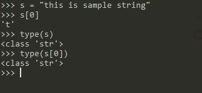
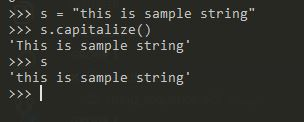

![Python][python]
# Python
> Interpretted language. Enjoyable to write, easy to read and lot clearner

## Zen of Python
* ### Flat is better than nested
```Python
a = 'kannan'
if a == 'kannan':
    print('a is kannan')
else:
    if a == 'Raksith':
        print('a is Raksith')
```
Following is better than above
```python
a = 'kannan'
if a == 'kannan':
    print('a is kannan')
elif a == 'Raksith'::
    print('a is Raksith')
```

* ### Explicit is better than implicit
```python
ctr = 5
while ctr != 0:
    print(ctr)
    ctr -= 1
```
Above is better than following
```python
ctr = 5
while ctr
    print(ctr)
    ctr -= 1
```
## Collections
## str
> **Strings** are represented by keyword **`str`** in python
* **Immutable*** as in `csharp` (i.e., once contructed could not modified)
* string can be wrapped in **single quotes**(\') and **dboule quotes**(\")
* Using one quoting style allows other quote as valid character in string.
example **`'he said "true"'`*** or **`"he said 'true'"`**. This avoid escape characters.
* Multiline string can be represented with three single quotes or three double quotes or escape characters
* To avid escape sequences can use **raw string** indiacator.
Instead of **`"C:\\users\\kannan"`** you can mention **`r"C:\users\kannan"`**
* String is the**sequence of characters but which are also string**.

* **Capitalize** method returns string with first letter capitalized.

## Bytes
TODO: Read
## List
> Sequence of objects
* Enclosed in **square brackets**
```python
[1, 2, 3, 4, 5,6]
```
* As it is sequence of objects it can have any **data type**
```python
["kannan", "Raksith", 3]
```
* New items can be added using **Append Metho**
```python
stringList = ["Kannan", "Raksith"]
stringList.append("new name")
stringList
["Kannan", "Raksith", "new name"]
```
## Dicionary
> Key value pair collection. Widely used collection type in Python
sample literal dictionary.
```python
personDetails = {'name': 'Kannan', 'age': 33, 'city': 'Lake Bluff', 'state': 'Illinois', 'phone': '224 280 2046'}
personDetails['name']
'Kannan'
```