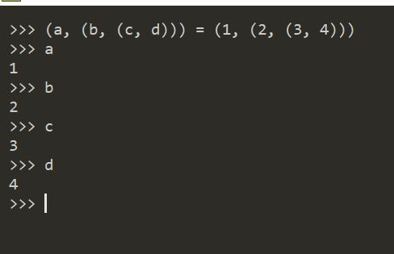
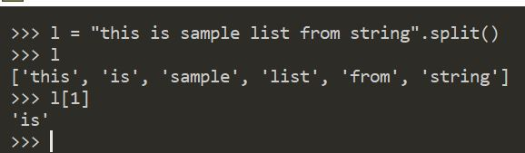

# Python
> Interpretted language. Enjoyable to write, easy to read and lot clearner
* Python is Dynamically and Strogly typed programming language
* Everything is an object in Python
## PEP (Python Enhancement Proposals)
>Python is developed by following set of proposals
* **PEP-8** for Style guide for Python
* **PEP-20** is called Zen of Python which provided best practices for Python

## Zen of Python
* ### Flat is better than nested
```Python
a = 'kannan'
if a == 'kannan':
    print('a is kannan')
else:
    if a == 'Raksith':
        print('a is Raksith')
```
Following is better than above
```python
a = 'kannan'
if a == 'kannan':
    print('a is kannan')
elif a == 'Raksith':
    print('a is Raksith')
```

* ### Explicit is better than implicit
```python
ctr = 5
while ctr != 0:
    print(ctr)
    ctr -= 1
```
Above is better than following
```python
ctr = 5
while ctr
    print(ctr)
    ctr -= 1
```
## Collections
### Tuples
> **Immutable** collection
* Enclosed in **parantheses**
* Can store **any type** of object 
```python
t = ("Chicago", 2.3, 3)
```
* Can be **nested**
```python
t = ((1,2),(2,3),(3,4))
```
* Elements can be accessed using **index**
* Nested tuple elements can be accessed uisng multi dimentional array style
* **Single element** enclosed in parantheses is parsed as int not tuple. Single element tuple should have comma seperator before closing parantheses

    
* **Parentheses are optional**

    
* **Return more than one values** from function as tuple (ref. [tuple.py](./tuple.py))
* Can **Unpack tuple** into refs variables (ref. [tuple.py](./tuple.py))
* Can **Unpack nested tuple** into ref variables 

    
* Ability of unpacking nested tuples idiomatic python operations like swap in Python

    
* tuple can be **created from other collections** using tuple() constructor

    
* Tuple elements can be **accessed by index**

    
* Tuple elements can be accessed using **negative 1 based index** in **reverse**

    

### str ([str_ops.py](./str_ops.py))
> **Strings** are represented by keyword **`str`** in python
* **Immutable** as in `csharp` (i.e., once contructed could not modified)
* string can be wrapped in **single quotes**(\') and **dboule quotes**(\")
* Using one quoting style allows other quote as valid character in string.
example **`'he said "true"'`*** or **`"he said 'true'"`**. This avoid escape characters.
* **Multiline** string can be represented with **three** single **quotes** or three double quotes or escape characters
* To avid escape sequences can use **raw string** indiacator.
Instead of **`"C:\\users\\kannan"`** you can mention **`r"C:\users\kannan"`**
* String is the **sequence of characters but which are also string**.
    
    
* **Capitalize** method returns string with first letter capitalized.

    
* **Concat** using ```+``` symbol
* Larger strings can be concatenated using **join method**

    

* **split** using seperator

    
* Split with out seperator take ```" "``` as seperator
    
    
* **Partition** splits string into 3 pieces using seperator as part before seperator, seperator itself and part after seperator **as tuple**

    

* **format**. Format internally considers variables list as tuple

    
### range
> Generates **sequence of ints** from the specified **start** value untill the ***stop*** value. Stop value wont be included. **Step** can be sused to jump in the range.
* **start** is optional. Default value is 0
* **step** is optional. Default is 1
* When using step, start is mandatory 

    
### Bytes
TODO: Read
### List
> Sequence of objects. **Mutable**
* Enclosed in **square brackets**
```python
[1, 2, 3, 4, 5,6]
```
* As it is sequence of objects it can have any **data type**
```python
["kannan", "Raksith", 3]
```
* New items can be added using **Append Metho**
```python
stringList = ["Kannan", "Raksith"]
stringList.append("new name")
stringList
["Kannan", "Raksith", "new name"]
```

* Items can be accessed forward direction using 0 based **positive index**

    

* Items can be accessed reverse direction using **1 based negative idnex**

    

* **Slicing** extracts part of the list. Includes element at start index and excludes element at stop index


    
* Slicing list without start and end index creates new copy of the original list

    
* All three copy methods (list ctor, list.copy() and list[:]) does **shallow copy** not deep copy

    
* Multiplying list by number will ***repeat*** the list item given number of times

    
* List **repeat** does **shallow copying** of referenced objects

    
* ```list.index(item)``` gives index of the item in list
* ```list.count(item)``` give number of occurances of item in the list
* ```item in list``` checks if item present in the list
* ```item not in list``` checks if item does not present in the list
    
    

* ```del list[index]``` removes element by **index**

    

    

* ```remove(value)``` removes element by **value**

    

* ```list.insert(index, new_item)``` insert new item in the index mentioned

    

* All iterable series can be concatenated using `+` operand or `extend` method

    
    

* `reverse` reverse the list **in-place**

    

* `sort` sorts list **in-place**

    

    `reverse = True` option sorts in desc order

    

    

* `reversed` creates reversed **copy** of original list. Result as iterator

    

* `sorted` creates sorted copy or original list

    

### Dicionary
> Key value pair collection. Widely used collection type in Python
sample literal dictionary.
```python
personDetails = {'name': 'Kannan', 'age': 33, 'city': 'Lake Bluff', 'state': 'Illinois', 'phone': '224 280 2046'}
personDetails['name']
'Kannan'
```
### Collection Enumeration
* Any enumerable collection can be used directly in for loop

    

* Any enumaerable collection can be enumerated using ```enumerate``` method. Returns **pair tuple** with index and value

    

## Runtime Arguments
>Runtime arguments can be accessed through sys.argv collection. sys.argv[0] is the file name of the module so, real runtime arguments will be starting from sys.argv[1]

## Docstrings
>Method and Module documentation technique which is enclosed in """<<'Content'>>""". For method it should be the first line in body of the method and for moudles it should be the first line in the module
## Integer
>Integer is **immutable** **reference** type in python
## Value and Identity comparison
> id(object) gives id associated to the reference type. Identity comparison check if both references are refering to the same object where as value comparison checks if value of the object is equal or not
```python
la = [1,2,3]
lb = [1,2,3]

if a is b:
    print('Identity matches')
else
    print('Identity does not matches')

if a == b:
    print('Value matches')
else:
    print('Value does not matches')
```
```
Output:
Identity does not matches
value matches
```
## Positional and Keyword arguments
>All keyword arguments must be mentioned after positional arguments
## Default values arguments
* Default valued argument expressions will be evaluated only once
## Scope
* Local
* Enclosing
* Global
* Built-in
>When encountered variables, it would be scanned for decleration in local scope before goin to global scope.
* ```Accessing / modifying global variables from local is not recommended```
## Explore Type and Attributes of object
>```type(<object name>)``` shows type of the object
>```dir(<object name>)``` shows attributes of the object
## Unused waring suppression
> unused variable waring can be suppressed by assigning vale to `_` variable


